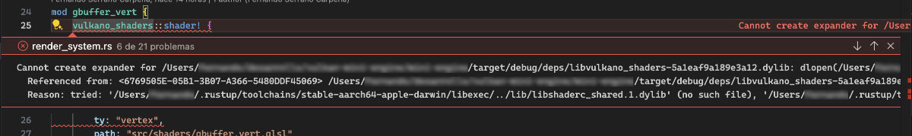

# Vulkan mini engine

This project is a mini graphics engine implemented in Rust language with Vulkan, through the Vulkano library. Vulkano reduces the boilerplate considerably, while allowing low-level Vulkan features to be implemented.

The aim of this project is to study interesting features of the Rust language and Vulkan, implementing an interesting application with no pretensions of becoming a more complex project.

## Objectives 

The idea is to implement the following features:

- Multi-pass rendering: deferred render, generating g-buffers for colour, normals, depth and position.
- Off screen rendering of cube maps for reflections and ambient lighting.
- PBR materials.
- Loading models in OBJ format.

## Roadmap

- ✅ Vulkan window and basic Vulkan elements: Vulkan instance, device, queues, command buffers and memory allocators.
- Rendering system: swap chain, depth buffer and a pipeline for direct rendering with the basic properties of a material.
- 3D objects: vertex and index buffers and rendering of a sample object.
- Basic lighting: basic blinn-phong lighting system.
- Texture loading: generic texture loading system, which will then be used to load different maps (albedo, normals, metalness, roughness).
- Multi-pass rendering: g-buffers generation and combining them with the basic lighting system.
- Sky box: we will add a sky box from a texture in equirectangular format.
- Cubemaps: generation of cubemaps for the roughness and ambient lighting maps.
- PBR: implementation of PBR in the lighting phase.

## Installation

At the time of starting this project, the latest version of Vulkano is almost a year old, and quite a few API-breaking changes have been introduced in the main Git branch. So until the Github version is released (I guess version 0.35) we will use the unstable Vulkano version from the Git repository. The Vulkano repository is added as a sub module. We will use the Git version instead of the official crate, until version 0.35 is released.

To download the submodule, if the `--recursive` option was not used when cloning the project, run:

```sh
$ git submodule update --init
```

You will also need to install the following for your platform (Windows, macOS or Linux):

- Rust: [https://www.rust-lang.org](https://www.rust-lang.org)
- Vulkan SDK: [https://www.lunarg.com/vulkan-sdk/](https://www.lunarg.com/vulkan-sdk/)

## Debug using Visual Studio Code in macOS

The environment variable system does not work in GUI applications on macOS. You can run the application with `cargo run` just like on Windows or Linux, but to use the Visual Studio Code debugger, the `libvulkan.dylib` library will not be found when launching the application. To make it work, open the `mini-engine` directory as a workspace in VS Code, open a terminal and create a symbolic link to the Vulkan library in that same directory.

In addition to this, for the `vulkano_shaders::shader!` macro to work from the debugger, and to be recognised by the linter, a symbolic link of the `libshaderc_sared.1.dylib` library must be created in the correct location, which will be the directory where the compiled Rust utilities are placed. You can find out the location from the error message in the VS Code interface.



The error indicates that the library could not be opened, and if you expand the whole message, it will show the path where you tried to find the library. It will probably be the following (or a very similar one):

```sh
~/.rustup/toolchains/stable-aarch64-apple-darwin/lib/libshaderc_shared.1.dylib
```

So to solve this bug, just create a symbolic link to the library:

```sh
$ ln -s /usr/local/lib/libshaderc_shared.1.dylib ~/.rustup/toolchains/stable-aarch64-apple-darwin/lib/libshaderc_shared.1.dylib
```

Note: The above line assumes that VulkanSDK is installed in /usr/local/lib. If it was installed in another location, modify the first argument of the `ln` command above.
